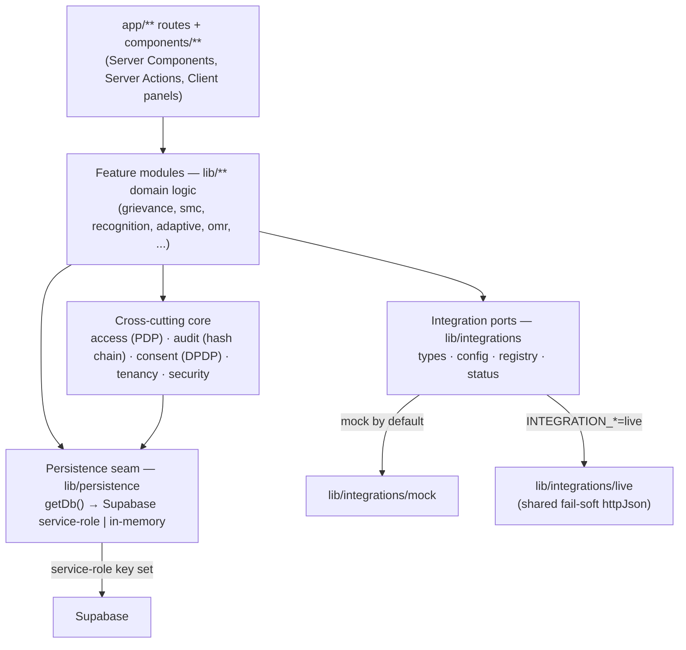
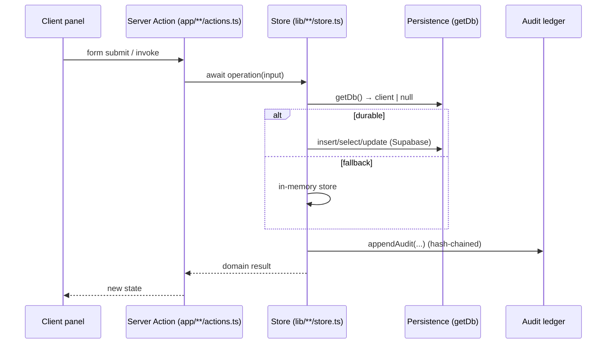
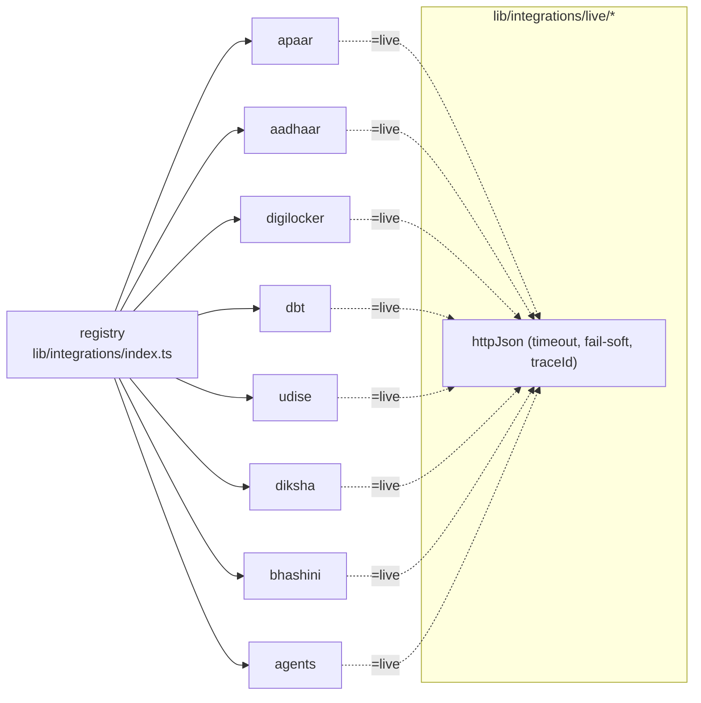

# VASA-EOS(SE) — Architecture & Module Map

A Next.js 15 (App Router) + React 19 + TypeScript platform. Business logic lives in
framework-agnostic modules under `lib/`; `app/` holds routes (pages, server actions,
route handlers); `components/` holds shared UI. Every external dependency sits behind
a typed **port** with a mock and a real adapter, so the platform runs with no
credentials and flips to live providers via environment variables.

## Layers

## Request / data flow

## `lib/` module map

| Concern | Modules |
| --- | --- |
| **Domain & identity** | `domain` (APAAR-centric ER model, 21 RPwD), `sis` (360° student records), `tenancy` (7-tier sovereign multi-tenancy) |
| **Access & security** | `access` (5-model PDP: RBAC·ReBAC·ABAC·PBAC·CABAC, deny-wins), `security` (zero-trust headers), `audit` (tamper-evident hash chain), `consent` (DPDP ledger) |
| **Integrations** | `integrations` (`types`, `config`, `mock`, `live`, `http`, `status`, registry), `agents` (8-agent orchestration over the AgentProvider port) |
| **Persistence & data** | `persistence` (DB seam + test override), `data` (polyglot store architecture), `supabase` (server client) |
| **Learning / AI core** | `adaptive` (BKT + ZPD), `knowledge-graph` (prereq DAG, learning paths), `omr` (OMR scoring), `credentials` (NFT/SBT verifiable credentials) |
| **Governance & compliance** | `governance-framework` (RACI/forums), `recognition` (TN 1973 workflow), `quality` (inspection index), `exams` (exam security) |
| **Welfare & operations** | `meals` (PM POSHAN/CMBS), `finance`, `procurement`, `smc` (DAO-style SMC) |
| **Student services & facilities** | `hostel`, `library`, `transport`, `health` (RBSK), `grievance`, `infrastructure`, `emergency` (TNSDMA), `cocurricular`, `esg`, `accessibility` |
| **Platform & UX** | `i18n` (react-i18next, ta/en/hi), `notifications`, `portal-data` (KPI aggregation), `selftest` (in-app health checks), `auth` |

Interactive modules that persist follow a **client-safe / server-only split**:
`index.ts` holds constants/types/pure helpers (safe to import from `"use client"`
components); `store.ts` holds the async DB/audit functions (imports `next/headers`
transitively, so it must never be imported by client code).

## `app/` routing

- **App Router** with a `(dashboards)` route group. Server Components by default;
  interactive panels are `"use client"` and call **Server Actions** (`actions.ts`,
  which may export only async functions).
- **Role portals** — `admin`, `teacher`, `principal`, `institution-head`,
  `academic-head`, `subject-incharge`, plus the stakeholder portals `crcc`, `beo`,
  `deo`, `director`, `secretary`, `minister`, `vendor`, `researcher`, `public`.
  Navigation is driven by `config/dashboard-nav.ts`; portal registry in
  `config/portals.ts`.
- **Feature routes** map 1:1 to `lib/` modules (e.g. `/grievance`, `/smc`,
  `/recognition`, `/adaptive-learning`, `/omr`, `/knowledge-graph`, `/credentials`,
  `/content`, `/school-registry`, `/aadhaar`, `/dbt`, `/multilingual`, `/pm-poshan`,
  `/exams`, `/infrastructure`, `/emergency`, `/integrations`, `/health`).
- **`app/api/`** — route handlers (seed, notifications, blob).
- **`middleware.ts`** applies `SECURITY_HEADERS` from `lib/security`.

## The integration seam (one transport, eight ports)

See **[OPERATIONS.md](OPERATIONS.md)** for the env-var matrix per port.

## Testing architecture

- Node 22's **built-in test runner + type-stripping** (no jest/vitest). A small ESM
  loader (`scripts/test-loader.mjs`) resolves the `@/` alias and `.ts` extensions and
  stubs `next/headers` for the audit import chain.
- **Pure modules** are tested directly; the **persisted store path** is tested via an
  in-memory Supabase-like client (`tests/helpers/fake-db.ts`) injected through the
  `__setTestDb` seam in `lib/persistence`; **live adapters** via a mocked `fetch`.
- Coverage is enforced (`pnpm run test:coverage`); CI posts a coverage comment.

See **[CONTRIBUTING.md](CONTRIBUTING.md)** for the conventions behind these.
