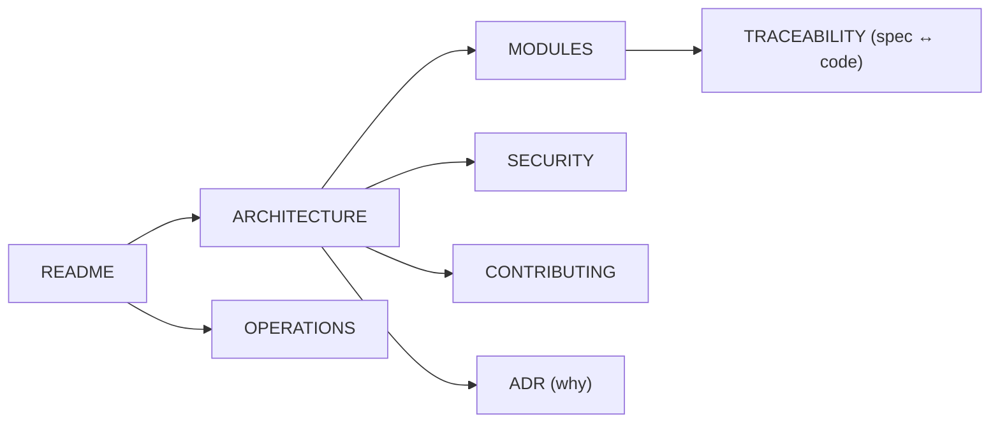
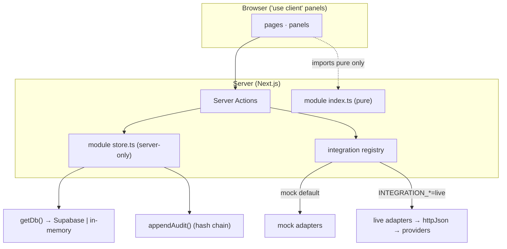

# VASA-EOS(SE) — Documentation

An AI-native, India-Stack-aligned education operating system. Every external
dependency runs behind a typed **port** with a mock and a real adapter, so the
platform runs end-to-end with **no credentials** and flips to live providers via
environment variables — no code change.

Start at the repo [README](../README.md), then use this index.

## Documentation map

| Doc | What it answers |
| --- | --- |
| [ARCHITECTURE](ARCHITECTURE.md) | How it's built — layers, the `lib/` module map, routing, the integration seam, testing architecture. |
| [MODULES](MODULES.md) | Per-module reference — purpose, key exports, route, and persistence for each of the 40 `lib/` modules. |
| [SECURITY](SECURITY.md) | The enforced guardrails — 5-model access PDP, hash-chained audit, DPDP consent, tenant isolation, zero-trust. |
| [OPERATIONS](OPERATIONS.md) | Go-live runbook — integration env-var matrix, Supabase setup, feature-flag posture, security/privacy notes. |
| [CONTRIBUTING](../CONTRIBUTING.md) | Setup, the gate, and the conventions that keep the build green. |
| [TRACEABILITY](TRACEABILITY.md) | Dossier sections / flagships → implementing modules, routes, and tests. |
| [ADR](ADR.md) | Architecture decision log — the context, decision, and consequences of the big calls. |
| [STATUS](STATUS.md) | Completion & pending register — the full delivery timeline and what's done vs pending against the master document. |
| [REQUIREMENTS](REQUIREMENTS.md) | What's needed to go fully live — every real credential, MoU, and infrastructure dependency, one by one. |
| [EVALUATION](EVALUATION.md) | Investor-lens readiness review (Altman/YC questions): the wedge, the scorecard, and the pilot-readiness checklist. |
| [CREDENTIALS](CREDENTIALS.md) | User categories, the governance hierarchy, per-role IAM (RBAC/ReBAC/ABAC/PBAC/CABAC), and demo login credentials. |

### Suggested reading order



## Repository map

```mermaid
flowchart TD
  ROOT["VASA-EOS-SE-"]

  ROOT --> APP["app/ — App Router<br/>pages · actions.ts · api/ · (dashboards)"]
  ROOT --> LIB["lib/ — business logic<br/>40 framework-agnostic modules"]
  ROOT --> COMP["components/ — shared UI<br/>shell · page-header · portal-dashboard · i18n"]
  ROOT --> CFG["config/ — portals.ts · dashboard-nav.ts"]
  ROOT --> MW["middleware.ts — security headers"]
  ROOT --> SCRIPTS["scripts/ — SQL migrations 001–015<br/>+ test loader/register/stubs · coverage-summary"]
  ROOT --> TESTS["tests/ — 13 files / 95 tests<br/>+ helpers/fake-db"]
  ROOT --> DOCS["docs/ — this documentation set"]
  ROOT --> CI[".github/workflows/ci.yml<br/>lint · typecheck · build (20/22) · unit tests + coverage"]
  ROOT --> MISC["actions/ · hooks/ · types/ · styles/ · public/"]

  LIB --> L1["domain · sis · tenancy"]
  LIB --> L2["access · audit · consent · security"]
  LIB --> L3["integrations (types·config·mock·live·http·status) · agents"]
  LIB --> L4["persistence · data · supabase"]
  LIB --> L5["adaptive · knowledge-graph · omr · credentials"]
  LIB --> L6["governance · recognition · quality · exams · smc · grievance"]
  LIB --> L7["meals · finance · procurement · hostel · library · transport · health · infrastructure · emergency · cocurricular · esg"]
  LIB --> L8["i18n · accessibility · portal-data · selftest · notifications · auth"]
```



## How it fits together



## Runtime surfaces

- **`/integrations`** — each port's live/mock mode and configuration readiness.
- **`/health`** — live self-tests of the core guardrails + persistence/integration posture.
- **`GET /api/health`** — machine-readable JSON of the same self-tests for uptime
  monitors / load balancers (200 healthy, 503 when a guardrail fails; never cached).
- **`GET /api/integrations`** — machine-readable integration posture (per-port mode +
  config readiness; never the secret values).
- **`?`** — keyboard-shortcuts help · **⌘/Ctrl+K** — command palette.

## Quickstart

```bash
pnpm install --no-frozen-lockfile
pnpm dev                 # http://localhost:3000  (all mock, in-memory)

pnpm run lint && pnpm run typecheck && pnpm run build
pnpm run test:coverage   # 95 unit tests + enforced thresholds (Node >= 22.6)
```

> The mermaid diagrams render natively on GitHub.
