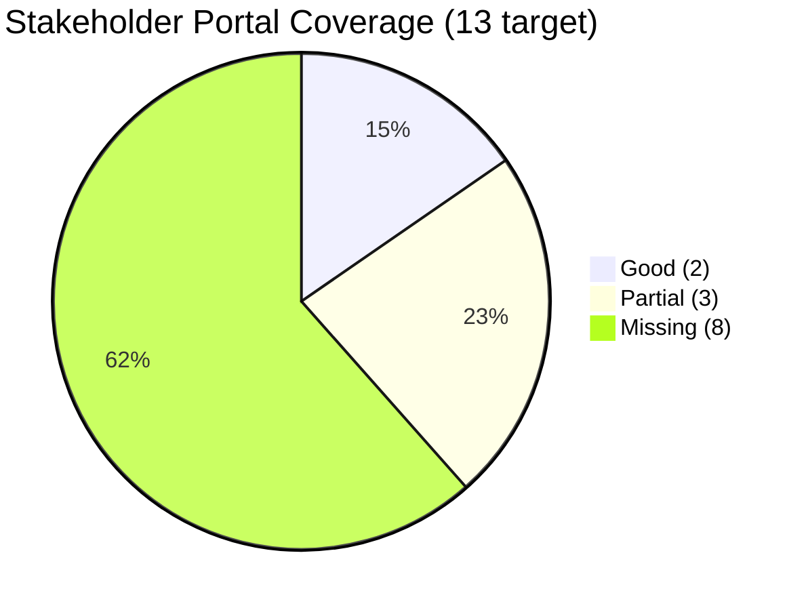

# VASA‑EOS (SE) — Gap Analysis: Current Codebase vs Master Blueprint

**Scope:** Compares the current Next.js application in this repository against the target state defined in `VASA-EOS-SE-Implementation-Blueprint.md` (derived from the 513‑page Master Dossier v2.5).
**Method:** Static inspection of `app/`, `lib/`, `config/`, `types/`, `package.json` (commit on `claude/zen-lamport-IOrhd`).
**Verdict (one line):** The repo is a **credible governance + NEP‑tracking + school‑administration MVP** covering roughly **8 of 72 functional sections** and **~5 of 13 stakeholder portals** at dashboard depth — a strong Division VII (Stakeholders) + Division VIII (governance/tracking) slice, but the AI, identity‑federation, integration, security, multilingual and welfare‑operations cores (Divisions II–VI) are largely **not yet started**.

> ⚠️ **Naming note `[CLARIFY]`** — Repo `README.md` says "education operating system for **secondary** education", but the dossier defines **EOS(SE) = Education Operating System for *School* Education** (K‑12, Anganwadi‑to‑Alumni). These differ in scope (K‑12 vs 9‑12). Confirm intended scope before deeper build, since it changes the student lifecycle, NIPUN/FLN modules, and Anganwadi bridge.

---

## 1. Current codebase inventory

### 1.1 Technology stack (as built)
| Concern | Present | Blueprint target (L‑layer) | Gap |
|---|---|---|---|
| Frontend | Next.js 15, React 19, Tailwind, shadcn/ui, recharts, react‑simple‑maps | L11 Next.js ✓ (+ React Native/Flutter mobile, PWA, IVR, WhatsApp) | No mobile apps, no offline‑first PWA, no IVR/WhatsApp, no AIGUI/AIUGI |
| Backend | Next.js server actions + route handlers; Supabase (Postgres) | L7 microservices (Spring/NestJS/FastAPI/Go), DDD, sagas | Monolith‑on‑Supabase; no microservices, workflow engine, or event bus |
| Data | Supabase Postgres only; `@vercel/blob` for files | L4 polyglot (PG+Mongo+Redis+Neo4j+ES+ClickHouse+Timescale+vector+S3+Hyperledger) + Kafka | Single relational store; no event sourcing, lake, KG, vector, or ledger |
| Identity | Supabase Auth + custom `users` table (role, school_id) | L5 APAAR/UDISE+/Teacher‑ID/Aadhaar/DigiLocker + 5 AC models + MFA | No federated identity, no APAAR/Aadhaar, single RBAC only |
| AI/ML | none | L9/L10 8 agents, knowledge tracing, OCR/OMR, KG, federated learning | Entire AI core absent |
| Integration | none (internal only) | L3 India Stack + 50+ govt systems | No external integrations |
| Security | Supabase RLS (implied), audit log table | L1‑data zero‑trust 7‑layer, SIEM/SOC, HSM, CERT‑In | Audit logging exists; no zero‑trust, SIEM, HSM, mTLS |
| Observability/CI | not evident in repo | Prometheus/Grafana/Jaeger/OpenTelemetry; 13 test strategies | No tests, observability, or CI gates visible |

### 1.2 Implemented features (by area)
- **Governance:** org units, roles & permissions, user management + per‑user assignments, governance dashboard, audit log. *(Maps to blueprint Sec 52 IAM, Sec 66 Audit — partial.)*
- **NEP / programme tracking:** `tracking/` (dashboard, milestones, challenges, stakeholders, implementations, reports). *(Maps to Part XXI–XXV implementation tracking — good fit.)*
- **Policies & schemes:** policy CRUD + versioned view/edit; scheme catalogue + detail. *(Maps to Sec 10 TN policy, Sec 12/13 schemes — catalogue depth only, no DBT/eligibility engine.)*
- **Principal (school ops):** students (SIS), staff, assessment & exams, fee management, school health, compliance, announcements.
- **Academic‑head / Subject‑incharge:** curriculum, assessment, teacher‑PD, planning, resource allocation, teacher coordination, student performance.
- **Institution‑head:** strategy, policy, stakeholders, resources.
- **Parent:** attendance, performance, fees, communication.
- **Student:** courses, assignments, grades, resources, announcements (basic LMS).
- **Teacher:** courses + create course.
- **Platform services:** notifications API, report export API, seed API, blob upload, audit logging lib.

---

## 2. Stakeholder‑portal coverage (target = 13)

| # | Blueprint portal | Repo status | Notes |
|---|---|---|---|
| 1 | Student | 🟡 Partial | LMS basics (courses/assignments/grades); no adaptive learning, DigiLocker, career, CWSN, Tamil‑first |
| 2 | Parent | 🟡 Partial | Attendance/performance/fees/communication; no IVR/WhatsApp/dialects, no scheme status, no UPI |
| 3 | Teacher | 🔴 Minimal | Only courses; no CPD/NPST, AI insights, attendance capture, transfer transparency |
| 4 | Principal/Headmaster | 🟢 Good | SIS, staff, assessment, fees, health, compliance, announcements |
| 5 | CRC Coordinator | 🔴 Missing | No mobile field app / GPS‑verified visits / NIPUN cluster tracking |
| 6 | BEO | 🔴 Missing | No block dashboard / AI‑prioritised inspections |
| 7 | DEO/CEO | 🔴 Missing | No district KPIs / heat maps / compliance traffic‑light |
| 8 | State Director (7 directorates) | 🔴 Missing | No directorate‑wide ops (ADMIN role is generic, not directorate‑scoped) |
| 9 | Secretary | 🟡 Partial | `admin` + `governance` + `tracking` approximate state‑wide visibility; not Secretary‑grade dashboards |
| 10 | Minister / CM | 🔴 Missing | No executive/constituency/election‑commitment dashboards |
| 11 | EdTech Vendor (NEAT) | 🔴 Missing | No developer portal/sandbox/marketplace |
| 12 | Researcher | 🔴 Missing | No anonymised dataset access / IRB workflow |
| 13 | Public | 🔴 Missing | No public transparency dashboards / RTI workflow / school finder |

**Extra roles in repo not in the 13:** `SUBJECT_INCHARGE`, `ACADEMIC_HEAD`, `INSTITUTION_HEAD` — these are sensible school/cluster sub‑roles but should be reconciled against the dossier's 7‑tier governance roles (CRCC/BEO/DEO/CEO/Director/Secretary). **Coverage: ~2 Good, 3 Partial, 8 Missing.**

---

## 3. Functional‑section coverage (target = 72 sections / 362 modules)

| Tier (sections) | Target modules | Repo status | Evidence |
|---|---|---|---|
| **National 1–9** (APAAR, NCF, DIKSHA, schemes, boards, NPST, India Stack, NETF/NDEAR, intl interop) | 45 | 🔴 ~0% | No APAAR/DIKSHA/India Stack/NDEAR federation |
| **State 10–17** (TN policy, 7 directorates, flagship schemes, welfare, recognition, SCERT, welfare boards, inter‑dept) | 36 | 🟡 ~15% | Policies + schemes catalogue + compliance pages; no DBT/recognition workflows |
| **District/Block/Cluster 18–24** | 29 | 🔴 ~0% | No DEO/BEO/CRCC operational modules |
| **School 25–51** (student lifecycle, teacher mgmt, attendance, curriculum, assessment, adaptive, NIPUN, PM POSHAN, health, inclusion, transport, hostel, library, scheme ops, parent, SMC, PTA, infra, inventory, finance, recognition, quality, comms, grievance, green, co‑curricular, sports) | 127 | 🟡 ~20% | SIS, staff, assessment, fees, health, compliance, announcements, basic LMS exist; ~21 of 27 categories absent (attendance‑capture, adaptive, NIPUN/FLN, PM POSHAN, inclusion, transport, hostel, SMC, grievance, green, etc.) |
| **Cross‑cutting 52–72** (IAM, security, data, integration, OCR/OMR, AI/ML, NLP, KG, analytics, OR, workflow, notification, docs, privacy/consent, audit, risk, emergency, blockchain, federation, AI ethics, portals) | 75 | 🟡 ~10% | IAM (basic RBAC), audit, notifications partly exist; 18+ sections absent |

**Aggregate (rough, by module weight):** ~8–10% of the 362‑module target is implemented at any depth, concentrated in governance/tracking/school‑admin.

---

## 4. Architecture‑layer gap (12 layers)

| Layer | Status | Priority to close |
|---|---|---|
| L11 Experience | 🟡 web only | P2: PWA offline, mobile, IVR/WhatsApp, AIGUI, WCAG AAA |
| L10 AI Orchestration | 🔴 | P3: agents + MCP after data foundation |
| L9 AI/ML | 🔴 | P3 |
| L8 Workflow | 🔴 | P2: Temporal/Camunda for schemes/recognition/exceptions |
| L7 Application/modules | 🟡 monolith | P2: extract bounded contexts incrementally |
| L6 Gateway/mesh | 🔴 | P2: Kong/Istio when services split |
| L5 Identity | 🟡 RBAC only | **P1: APAAR/Aadhaar federation + 5 AC models + MFA** |
| L4 Data | 🟡 PG only | **P1: event bus + lake + KG/vector as AI lands** |
| L3 Integration | 🔴 | **P1: India Stack (Aadhaar/DigiLocker/DBT/UDISE+)** |
| L2 Platform svcs | 🟡 Supabase | P2: K8s/Vault/Redis/MinIO for sovereign hosting |
| L1 Infrastructure | 🟡 Vercel/Supabase | **P1: TN State Data Centre / MeitY cloud + sovereignty** |

> **Sovereignty flag `[CLARIFY]`** — Current hosting implies Vercel + Supabase (managed, non‑sovereign). The dossier mandates TN State Data Centre / MeitY‑empanelled cloud with data localisation and source‑code escrow. This is a **P1 blocker** for government‑grade status and must be decided early.

---

## 5. Cross‑cutting government‑grade gaps (highest risk)

1. **Identity & APAAR (P1):** no APAAR/UDISE+/Teacher‑ID/Aadhaar/DigiLocker; only Supabase Auth + RBAC. Blueprint needs 5 access‑control models + MFA + consent.
2. **DPDP compliance‑by‑design (P1):** no consent ledger (InDEA 2.0), DPO tooling, children's‑data protection, retention/erasure. Penalty exposure ≤ ₹250 Cr.
3. **Data sovereignty (P1):** non‑sovereign managed hosting; no escrow/export guarantees.
4. **Zero‑trust security (P1):** audit log exists, but no SIEM/SOC, HSM, mTLS, micro‑segmentation, CERT‑In 6‑hr reporting.
5. **Multilingual / Tamil‑first (P2):** UI appears English‑only; no Bhashini ASR/TTS, 8 Tamil dialects, IVR, code‑mix, OCR.
6. **Accessibility WCAG 2.2 AAA + 21 RPwD (P2):** shadcn gives a baseline but AAA + ISL/AAC/Braille/screen‑reader certification not evidenced.
7. **Scheme DBT engine (P2):** schemes are catalogue pages, not eligibility→APBS→reconciliation→leakage‑detection pipelines.
8. **AI core (P3):** none of the 8 agents / 8 pillars / adaptive learning / OCR‑OMR.
9. **Production hardening (P2):** no tests, CI gates, observability, or DR evident.

---

## 6. Prioritised remediation backlog (MoSCoW × phase)

| Pri | Item | Maps to | Phase |
|---|---|---|---|
| **Must** | Decide sovereign hosting (TN SDC/MeitY) + data localisation + escrow | R‑17, §4.2 | P1 (M1–M8) |
| **Must** | Identity foundation: APAAR/UDISE+/Teacher‑ID model + 5 AC models + MFA | R‑01, L5 | P1 |
| **Must** | DPDP consent ledger + DPO tooling + retention/erasure + audit immutability | R‑14/15 | P1 |
| **Must** | India Stack integration spine (Aadhaar Auth, DigiLocker, DBT‑APBS, UDISE+) | R‑01/03/11, L3 | P1–P2 |
| **Must** | Reconcile roles → 13 portals + 7‑tier governance; add CRCC/BEO/DEO/Director/Minister/Public | Part XVIII, Sec 7A | P1–P2 |
| **Should** | Event bus (Kafka) + workflow engine (Temporal/Camunda) for schemes/recognition/exceptions | L8, Sec 12B | P2 |
| **Should** | Scheme DBT engine (eligibility→APBS→reconciliation→fraud detection) | R‑11 | P2 |
| **Should** | Multilingual/Tamil‑first + IVR/WhatsApp + WCAG AAA + 21 RPwD | R‑06/12, §3.1 | P2 |
| **Should** | Test suite + CI gates + observability + DR (production‑grade) | §5 | P2 |
| **Could** | PM POSHAN/CMBS ops, examination security, transport/hostel/library modules | R‑02/05 | P2–P3 |
| **Could** | AI core: 8 agents (MCP), adaptive learning, OCR/OMR, KG, federated learning | R‑07/10, Sec 16 | P3 |
| **Could** | Emerging tech: NFT‑SBT credentials, DAO‑SMC, AR/VR | R‑18 | P4 |

---

## 7. Recommended next 5 engineering actions
1. **Resolve the 3 P1 `[CLARIFY]` blockers** (scope SE=School vs Secondary; sovereign hosting; LLM/identity strategy) — these gate architecture.
2. **Model the APAAR‑centric domain** (see blueprint §1.3) in the data layer, even if Aadhaar/DigiLocker are stubbed in P1.
3. **Refactor `dashboard-nav.ts` roles → the 7‑tier governance taxonomy** and add the 8 missing portals as routed shells.
4. **Introduce DPDP consent + immutable audit primitives** as shared libs (`lib/consent`, extend `lib/audit`).
5. **Stand up CI quality gates** (unit + a11y + lint + type‑check) so production‑grade discipline starts now, not at P5.

---
*Companion to `VASA-EOS-SE-Implementation-Blueprint.md` and `VASA-EOS-SE-Traceability-Matrix.md`.*
